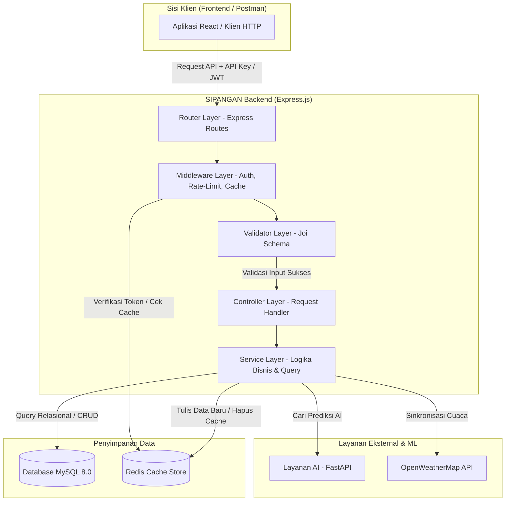

# 🌾 SIPANGAN (Sistem Informasi & Analisis Ketahanan Pangan) — Backend API

[](https://nodejs.org/)
[](https://expressjs.com/)
[](https://www.mysql.com/)
[](https://redis.io/)
[](https://jwt.io/)
[](https://swagger.io/)
[](https://opensource.org/licenses/MIT)

**SIPANGAN Backend API** adalah *core engine* berupa RESTful API berkinerja tinggi yang dirancang khusus untuk mengelola data ketahanan pangan, memproses komparasi harga regional, memfasilitasi integrasi prediksi AI, serta menyediakan data prakiraan cuaca regional. Dikembangkan oleh tim pengembang **S26**, backend ini menyajikan fondasi data yang aman, andal, dan efisien dengan proteksi keamanan berlapis, *rate limiting*, *audit logging* otomatis, serta sistem *caching* cerdas menggunakan Redis untuk wilayah **Jawa Timur**.

---

## 📌 Daftar Isi

- [✨ Fitur Utama](#-fitur-utama)
- [🛠️ Teknologi & Pustaka Utama](#%EF%B8%8F-teknologi--pustaka-utama)
- [📐 Arsitektur Sistem & Aliran Data](#-arsitektur-sistem--aliran-data)
- [📁 Struktur Folder Proyek](#-struktur-folder-proyek)
- [🚀 Panduan Instalasi & Penggunaan Lokal](#-panduan-instalasi--penggunaan-lokal)
- [⚙️ Konfigurasi Environment Variables](#%EF%B8%8F-konfigurasi-environment-variables)
- [🔒 Keamanan & Integrasi API](#-keamanan--integrasi-api)
- [🔮 Layanan Machine Learning (ML)](#-layanan-machine-learning-ml)
- [🧪 Rangkaian Pengujian (Testing)](#-rangkaian-pengujian-testing)
- [👥 Tim Pengembang (S26)](#-tim-pengembang-s26)
- [📄 Lisensi](#-lisensi)

---

## ✨ Fitur Utama

Layanan Backend SIPANGAN menyediakan serangkaian RESTful API tangguh yang mendukung visualisasi spasial, analisis prediktif, dan administrasi data terpusat:

### 1. 🔑 Keamanan Autentikasi & Kontrol Akses (RBAC)
Sistem pengamanan berlapis menggunakan **JSON Web Tokens (JWT)** yang mendukung skema token ganda (*Access & Refresh Tokens*) untuk menjaga kenyamanan sesi pengguna admin tanpa mengabaikan aspek keamanan.
*   **Role-based Access Control (RBAC)**: Pembatasan hak akses rute API berdasarkan peran hierarkis pengguna, mencakup tingkat peran **Super Admin**, **Admin**, dan **Operator**.
*   **Public API Key Protection**: Pengamanan rute-rute publik yang digunakan klien non-admin menggunakan mekanisme validasi header `x-api-key`.

### 2. 🔮 AI Predictive Price Connector
Integrasi dinamis dengan layanan kecerdasan buatan eksternal berbasis FastAPI untuk menyajikan ramalan harga pangan 1 bulan ke depan.
*   **Smart Database Caching**: Hasil pemanggilan layanan prediksi AI secara otomatis disimpan di dalam database MySQL lokal (tabel `predictions`) untuk mempercepat waktu respons permintaan data berikutnya dan menjaga availabilitas sistem jika layanan AI eksternal padam.

### 3. 🚨 Early Warning System (EWS) & Threshold Monitoring
Mesin analitik di sisi server yang menghitung stabilitas harga komoditas terhadap ambang batas (*threshold*) harga acuan daerah.
*   **Dynamic Severity Classification**: Mengklasifikasikan status fluktuasi harga komoditas di wilayah kabupaten/kota menjadi **Aman (Hijau)**, **Waspada (Kuning)**, dan **Krisis (Merah)** secara real-time.
*   **Automated Alert Logger**: Membuat entri secara otomatis di tabel `alerts` saat harga komoditas terpantau melampaui batas toleransi persentase kewaspadaan/krisis.

### 4. ⚡ Caching Cerdas & Invalidation (Redis)
Pemanfaatan Redis in-memory database sebagai lapisan penyimpanan cache performa tinggi guna mereduksi beban pemrosesan kueri relasional dan API pihak ketiga.
*   **Adaptive Cache Eviction**: Cache pada rute-rute data (seperti daftar komoditas, regional, dan peta) akan dihapus secara otomatis dan ditulis ulang sewaktu-waktu terjadi operasi penulisan, modifikasi, atau penghapusan data (CRUD).

### 5. 🌤️ Weather Forecast Sync (OpenWeatherMap)
Layanan integrasi cuaca yang menyinkronkan data prakiraan cuaca 5-Hari / 3-Jam dari OpenWeatherMap API dengan basis data lokal.
*   **Daytime Weather Sampling**: Hanya menyaring sampel data cuaca pada siang hari (pukul 13:00 WIB) yang merupakan faktor cuaca krusial bagi aktivitas panen dan distribusi pangan pertanian.
*   **Secure Trigger Sync**: Penyediaan endpoint pemicu sinkronisasi cuaca manual yang aman bagi operator berwenang untuk menyelaraskan data cuaca regional.

### 6. 📜 Audit Trail Komprehensif & Soft Delete
Sistem pencatatan log aktivitas otomatis serta integritas data historis:
*   **Activity Logging**: Middleware pencatat setiap aktivitas modifikasi yang dilakukan oleh admin atau operator (operasi POST, PUT, DELETE) ke dalam tabel `activity_logs`.
*   **Soft Delete Implementation**: Penggunaan penanda waktu `deleted_at` pada data master komoditas dan wilayah untuk menjaga integritas relasional data transaksi harga historis.

---

## 🛠️ Teknologi & Pustaka Utama

Backend API ini dibangun menggunakan ekosistem Node.js modern demi performa, keamanan, dan keandalan tingkat tinggi:

| Kategori | Teknologi/Library | Kegunaan |
| :--- | :--- | :--- |
| **Core Runtime** | Node.js (v16+), ES Modules | Lingkungan eksekusi Javascript modern di sisi server menggunakan ES Modules (`import/export`). |
| **Web Framework** | Express.js (v5.x) | Framework web andal untuk pengelolaan rute, penanganan middleware, dan request API. |
| **Database Relasional** | MySQL 8.0, mysql2 | Penyimpanan data relasional berkinerja tinggi serta adapter client non-blocking untuk Node.js. |
| **Caching Layer** | Redis, redis (npm) | Penyimpanan cache memori cepat untuk meminimalkan beban database dan API pihak ketiga. |
| **Keamanan & Enkripsi** | JSON Web Tokens, bcryptjs, Express Rate Limit | Pembuatan & verifikasi token (Access & Refresh), pengamanan password (hashing), serta perlindungan Brute Force. |
| **Validasi Skema** | Joi | Pustaka validasi skema masukan request (body, query, param) untuk integritas data sebelum diproses. |
| **Dokumentasi API** | Swagger UI Express, swagger-jsdoc | Penyusun spesifikasi OpenAPI 3.0 dari komentar JSDoc serta visualisasi endpoint interaktif. |
| **Pengujian Otomatis** | Jest, Supertest | Pengujian fungsionalitas unit dan integrasi (integration testing) endpoint API. |
| **Unique Identifiers** | uuid v4 | Pembuatan ID unik bertaraf industri global untuk seluruh record entitas database. |

---

## 📐 Arsitektur Sistem & Aliran Data

Backend SIPANGAN berperan sebagai jembatan tersentralisasi yang menghubungkan klien, basis data relasional, cache in-memory, serta layanan AI. Berikut diagram alir backend secara umum:



### Penjelasan Lapisan Arsitektur:
*   **Router & Middleware Layer**: Rute dikelompokkan per modul bisnis. Dilengkapi dengan middleware autentikasi (JWT / API Key), limiter frekuensi request, serta interceptor Redis cache.
*   **Validator Layer**: Setiap input diverifikasi ketat menggunakan Joi sebelum diteruskan ke Controller. Mencegah kesalahan format data dan eksploitasi input.
*   **Controller Layer**: Bertugas menjembatani input HTTP dengan logika bisnis (Service) serta menyusun format output JSON standar yang konsisten.
*   **Service Layer**: Mengandung semua aturan bisnis dan query database langsung ke MySQL, pemanggilan API eksternal (FastAPI & OpenWeatherMap), serta invalidasi cache Redis.

---

## 📁 Struktur Folder Proyek

Proyek backend ini disusun rapi dengan membagi modul bisnis secara mandiri (*modular structure*) untuk mempermudah pemeliharaan sistem:

```text
📁 BE-SIPANGAN/
├── 📁 data/                  # Folder dataset (CSV data historis pertanian Jawa Timur)
├── 📁 migrations/            # Berkas skema database relasional & seeder
│   ├── 📄 init.sql           # Pembuatan skema tabel awal MySQL
│   ├── 📄 seed.js            # Seeder data master (komoditas, wilayah, ambang batas)
│   └── 📄 import_historical_data.js # Skrip parser pengimpor data CSV historis
├── 📁 src/
│   ├── 📁 api/               # Lapisan API per Modul (Handlers & Routes)
│   │   ├── 📁 alerts/        # Manajemen data notifikasi & peringatan dinamis
│   │   ├── 📁 auth/          # Autentikasi (Register, Login, Token Refresh)
│   │   ├── 📁 commodities/   # CRUD data komoditas pangan
│   │   ├── 📁 history/       # Analitik data riwayat harga
│   │   ├── 📁 logs/          # Riwayat audit aktivitas administratif
│   │   ├── 📁 maps/          # Manajemen data spasial wilayah (GeoJSON)
│   │   ├── 📁 predict/       # Gerbang pemanggilan model prediksi ML
│   │   └── 📁 weather/       # Prakiraan cuaca regional & sinkronisasi
│   ├── 📁 config/            # Konfigurasi instansi (Database, Redis, Swagger)
│   ├── 📁 middleware/        # Express Middlewares (Auth, Cache, Rate limit, Errors)
│   ├── 📁 services/          # Logika Bisnis & Query database langsung
│   ├── 📁 utils/             # Helper fungsi utilitas & Custom Exception Classes
│   ├── 📁 validator/         # Validasi skema input data HTTP berbasis Joi
│   └── 📄 server.js          # Main Entry Point server Express.js
├── 📁 tests/                 # Rangkaian pengujian integrasi & unit (Jest & Supertest)
├── 📄 .env.example           # Berkas contoh konfigurasi variabel lingkungan
├── 📄 LICENSE                # Lisensi penggunaan proyek (MIT)
├── 📄 package.json           # Dependensi NPM dan skrip otomasi proyek
└── 📄 README.md              # Dokumentasi utama backend (Bahasa Indonesia)
```

---

## 🚀 Panduan Instalasi & Penggunaan Lokal

Ikuti langkah-langkah di bawah ini untuk menjalankan backend SIPANGAN di komputer lokal Anda:

### Prerequisites (Prasyarat)
*   **Node.js** (Rekomendasi versi LTS / v16 atau yang lebih baru).
*   **MySQL Server** (Versi 8.0 atau yang lebih baru).
*   **Redis Server** (Opsional, sangat disarankan untuk fitur caching).
*   **Git** untuk mengkloning repositori.

### Langkah 1: Kloning Repositori
```bash
git clone https://github.com/panen-predict-hub/BE-SIPANGAN.git
cd BE-SIPANGAN
```

### Langkah 2: Instalasi Dependensi
Jalankan perintah berikut untuk mengunduh semua pustaka yang dibutuhkan:
```bash
npm install
```

### Langkah 3: Konfigurasi Environment Variables
Salin file `.env.example` menjadi `.env` di direktori utama proyek:
```bash
cp .env.example .env
```
Buka file `.env` yang baru dibuat dan isi variabel sesuai dengan kredensial sistem Anda (Lihat bagian [Environment Variables](#%EF%B8%8F-konfigurasi-environment-variables) untuk detail lebih lanjut).

### Langkah 4: Setup Basis Data (Database Setup)
1.  Aktifkan MySQL Server Anda.
2.  Buat database kosong bernama `sipangan_db` (atau sesuai konfigurasi `DB_NAME` di `.env` Anda):
    ```sql
    CREATE DATABASE sipangan_db;
    ```
3.  Impor skema tabel yang berada di berkas [migrations/init.sql](file:///d:/backup/DATA%20LABIB/Coding%20Camp%202026/Capstone%20Project/sipangan-backend/migrations/init.sql) ke database Anda.
4.  Jalankan seeder data master (komoditas, wilayah, admin dasar):
    ```bash
    npm run seed
    ```
5.  Jalankan skrip impor data historis untuk mengisi data tabel riwayat harga dari dataset CSV pertanian Jawa Timur:
    ```bash
    npm run import-data
    ```

### Langkah 5: Jalankan Server Pengembangan (Local Dev)
Untuk menjalankan server backend dengan deteksi otomatis perubahan kode (*hot module replacement*) menggunakan nodemon:
```bash
npm run dev
```
Server akan berjalan secara default di port `3000` (atau port sesuai variabel `PORT` di `.env` Anda). Akses dokumentasi Swagger interaktif di `http://localhost:3000/api-docs`.

---

## ⚙️ Konfigurasi Environment Variables

Aplikasi backend membutuhkan konfigurasi variabel lingkungan agar dapat berfungsi dengan baik. Buat file `.env` di folder root dan konfigurasikan variabel berikut:

| Variabel | Tipe Data | Deskripsi | Contoh Nilai |
| :--- | :--- | :--- | :--- |
| `NODE_ENV` | String | Lingkungan eksekusi sistem. | `development` / `production` / `test` |
| `PORT` | Integer | Port yang digunakan oleh Express Server. | `3000` |
| `DB_HOST` | String | Alamat host server database MySQL. | `localhost` atau `127.0.0.1` |
| `DB_PORT` | Integer | Port koneksi database MySQL. | `3306` |
| `DB_USER` | String | Username pengguna MySQL. | `root` |
| `DB_PASSWORD` | String | Password pengguna MySQL. | `password_anda` |
| `DB_NAME` | String | Nama database proyek. | `sipangan_db` |
| `API_KEY` | String | Kunci API publik untuk validasi akses awal klien non-admin. | `your_secret_api_key_for_client` |
| `JWT_SECRET` | String | Kunci rahasia untuk menandatangani JWT Access Token. | `super_secret_access_key` |
| `REFRESH_TOKEN_SECRET`| String | Kunci rahasia untuk menandatangani JWT Refresh Token. | `super_secret_refresh_key` |
| `FASTAPI_URL` | String (URL) | Base URL dari layanan prediksi AI berbasis FastAPI. | `http://localhost:8000` |
| `ALLOWED_ORIGINS` | String | Asal/origins CORS yang diizinkan (dipisah koma). | `http://localhost:3000,http://localhost:5173` |
| `REDIS_URL` | String (URL) | URL koneksi instansi Redis Cache. | `redis://localhost:6379` |
| `SWAGGER_USER` | String | Username untuk masuk ke halaman Swagger API Docs. | `admin_swagger` |
| `SWAGGER_PASSWORD` | String | Password untuk masuk ke halaman Swagger API Docs. | `password_swagger` |

> [!WARNING]
> Jangan pernah membagikan file `.env` asli Anda ke repositori publik (seperti GitHub). File ini secara default telah ditambahkan di dalam `.gitignore`.

---

## 🔒 Keamanan & Integrasi API

Desain keamanan dan integrasi pada SIPANGAN Backend dirancang secara modular guna menjamin kerahasiaan dan integritas data:

1.  **Public API Key Gate (`x-api-key`)**: Semua endpoint API publik mewajibkan header `x-api-key` dengan nilai yang cocok dengan `API_KEY` di backend. Ini memitigasi eksploitasi data mentah oleh pihak luar tanpa izin.
2.  **Double-Token JWT Auth**: Endpoint administratif (CRUD, User Management, Logs) dilindungi oleh middleware verifikasi JWT. Sesi dikelola dengan *Access Token* (masa aktif singkat) dan *Refresh Token* yang aman untuk mencegah pembajakan sesi.
3.  **Role-Based Access (RBAC)**: Middleware membagi otorisasi admin ke dalam peran:
    *   **Super Admin**: Akses penuh, termasuk manipulasi log aktivitas admin lain dan pengelolaan akun admin.
    *   **Admin**: Mengelola data komoditas pangan, ambang batas harga, koordinat wilayah.
    *   **Operator**: Melakukan input harga harian dan sinkronisasi cuaca.
4.  **Rate Limiting Middleware**: Penerapan batas maksimum request per IP pada rute login admin guna meredam potensi serangan *brute force* dan *Denial-of-Service* (DoS).
5.  **Soft Delete & Audit Logging**: Penghapusan data master krusial tidak menghapus record secara permanen (melainkan mengisi kolom `deleted_at`). Setiap aksi tulis, edit, dan hapus admin secara otomatis dicatat pada `activity_logs` sebagai *audit trail* yang valid.

---

## 🔮 Layanan Machine Learning (ML)

Sistem **SIPANGAN** mengintegrasikan kecerdasan buatan untuk meramalkan tren harga komoditas pangan dan volume panen di masa mendatang.

*   **Layanan Prediksi AI**: Model ML dibungkus secara terpisah menggunakan kerangka kerja **FastAPI** yang berjalan secara default pada port `8000`. Backend Express.js ini bertindak sebagai klien yang melakukan pemanggilan API ke endpoint FastAPI (`FASTAPI_URL`).
*   **Tautan Repositori Model ML**: Anda dapat mengakses kode sumber, melatih ulang, mengunduh model, serta menjalankan API prediksi ML pada tautan berikut:
    🔗 **[ML-SIPANGAN (FastAPI & Machine Learning Model)](https://github.com/panen-predict-hub/ML-SIPANGAN)** *(atau hubungi administrator tim ML untuk tautan privat)*.
*   **Cara Memuat (Load) Model**:
    Dalam server FastAPI, model prediksi (misalnya berbasis model regresi linier, LSTM, atau model statistik runtun waktu lainnya) dimuat secara dinamis saat aplikasi FastAPI dijalankan. Pastikan Anda telah menempatkan berkas model berformat `.pkl` atau `.h5` di folder model pada repositori FastAPI tersebut sebelum menjalankan server ML.
    
    Backend akan memanggil FastAPI melalui rute berikut untuk mengambil ramalan harga berdasarkan nama komoditas dan wilayah:
    ```http
    GET {FASTAPI_URL}/predict?commodity={commodityName}&region={regionName}
    ```

---

## 🧪 Rangkaian Pengujian (Testing)

Kami menggunakan **Jest** dan **Supertest** untuk memastikan keandalan backend API ini.

*   **Menjalankan Seluruh Pengujian**:
    ```bash
    npm test
    ```
*   **Menjalankan Pengujian dalam Mode Watch (Development)**:
    ```bash
    npm run test:dev
    ```

---

## 👥 Tim Pengembang (S26)

Aplikasi ini dikembangkan dengan dedikasi penuh oleh tim **S26** dalam program Capstone Project:

**🖥️ Fullstack Developer**
*   **Refaldi Julidinsyah** — *Lead Developer / Frontend & GIS Integration* — [GitHub](https://github.com/rfldisyah) | [syahrefaldi@gmail.com](mailto:syahrefaldi@gmail.com)
*   **Labib Abdullah** — *Lead Developer / Backend & Database Management* — [GitHub](https://github.com/LabibAbdullah1) | [labibabdullahhasan@gmail.com](mailto:labibabdullahhasan@gmail.com)

**📊 Data Scientist**
*   **Shofia Ariska** — *Data Science / Pengolahan & Analisis Data* — [GitHub](https://github.com/shofiaariska) | [shofiaariskaa17@gmail.com](mailto:shofiaariskaa17@gmail.com)
*   **Meila Anriana** — *Data Science / Visualisasi & Analisis Statistik* — [GitHub](https://github.com/meilaanri) | [anrianaaa.k@gmail.com](mailto:anrianaaa.k@gmail.com)

**🤖 AI Engineer**
*   **Louis Claudio** — *AI Engineer / Machine Learning & Early Warning System* — [GitHub](#) | Universitas Sumatera USU
*   **I Putu Reynanda Putra Dynatha** — *AI Engineer / Integrasi Pipeline AI/ML* — [GitHub](#) | Universitas Mataram

Kami sangat terbuka untuk kolaborasi, feedback, dan perluasan platform untuk mendukung program ketahanan pangan di berbagai provinsi di Indonesia.

---

## 📄 Lisensi

Proyek ini dilisensikan di bawah **MIT License** - lihat file [LICENSE](LICENSE) untuk detail lengkap.

---
<p align="center">
  Disusun dengan 💚 oleh Tim S26 - SIPANGAN 2026.
</p>
